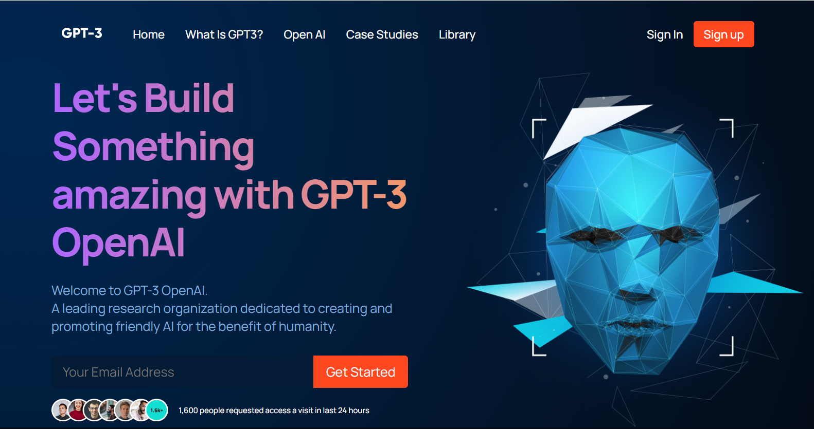

# GPT-3 OpenAI

This project can be found deployed [HERE](http://blaztted.github.io/Modern-UI-UX-GPT-3).

## Description

This project was developed with the goal of enhancing my skills in the following areas:

- React Functional Components: Focused on improving the reusability and modularity of components.
- React File and Folder Structure: Organized files and folders to follow best practices for maintainability and scalability.
- Fundamental CSS Properties: Mastered the use of Flexbox and Grid for layout design.
- Responsive Design: Implemented perfectly placed media queries to ensure satisfactory responsiveness across almost all device

Built using:

- Front-end library: React
- CSS animations library: Animista

## INSTALLATION

In the /MODERN-GPT3, you can run:

- **npm start**

Runs the app in the development mode.
Open http://localhost:3000 to view it in your browser.

The page will reload when you make changes.
You may also see any lint errors in the console.

- **npm test**

Launches the test runner in the interactive watch mode.

- **npm run build**

Builds the app for production to the build folder.
It correctly bundles React in production mode and optimizes the build for the best performance.
Your app is ready to be deployed!

## LICENSE

This project is subject to the MIT licensing terms.

## QUESTIONS

Should you have any inquiries regarding this repository, feel free to raise an issue or reach out to me directly via [bbc.silva@gmail.com](mailto:bbc.silva@gmail.com).
Explore more of my work at [blaztted](https://www.github.com/blaztted).
